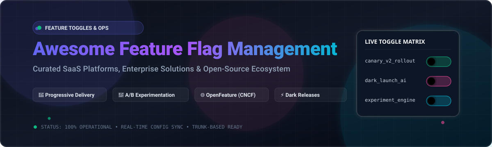

<p align="center">
  
</p>

# 🚩 Awesome Feature Flag Management

<p align="center">
  <a href="https://github.com/ishandutta2007/Awesome-Awesome-Awesome"></a><a href="https://discord.gg/jc4xtF58Ve"></a>
  <a href="https://opensource.org/licenses/MIT"></a>
  <a href="https://github.com/ishandutta2007/Awesome-Feature-Flag-Management/pulls"></a>
  <a href="https://github.com/ishandutta2007/Awesome-Feature-Flag-Management/stargazers"></a>
  <a href="https://github.com/ishandutta2007/Awesome-Feature-Flag-Management/network/members"></a>
  <a href="https://github.com/ishandutta2007/Awesome-Feature-Flag-Management/issues"></a>
  <a href="https://github.com/ishandutta2007"></a>
</p>

---

## 🚀 Top Feature Flag Management Platforms Ecosystem

> **A curated showcase of premier enterprise SaaS platforms and battle-tested open-source GitHub projects for Feature Flags, Feature Toggles, Progressive Delivery, Remote Configuration, A/B Testing, and Safe Continuous Deployment.**

**Last updated:** August 2026

---

### 🌐 What is Feature Flag Management?

**Feature Flag Management** (also known as *Feature Toggles*, *Feature Flippers*, *Conditional Releases*, or *Dynamic Remote Config*) empowers modern engineering and product teams to decouple software deployment from feature release. By controlling runtime feature evaluation via code or centralized dashboards, teams can:

- 🛡️ **Mitigate Deployment Risk**: Enable instant kill switches to roll back broken features in milliseconds without redeploying code.
- 🚀 **Practice Progressive Delivery**: Perform canary rollouts, percentage-based traffic splits, and dark launches.
- 🎯 **Target Specific Audiences**: Segment rollouts by user ID, tenant, region, platform, or custom attributes.
- 📊 **Run Rigorous Experimentation**: Execute multivariate and A/B tests with real-time statistical significance.
- ⚡ **Accelerate Trunk-Based Development**: Merge incomplete work safely into `main` without delaying release cycles.

---

## 📑 Table of Contents

- [☁️ SaaS / Hosted Platforms](#️-saashosted-platforms)
- [🔓 Open-Source GitHub Projects](#-open-source-github-projects)
- [💡 Architectural Patterns & Standards](#-architectural-patterns--standards)
- [🤝 How to Contribute](#-how-to-contribute)
- [📈 Star History](#-star-history)
- [⚖️ Disclaimer](#️-disclaimer)

---

## ☁️ SaaS/Hosted Platforms

The table below lists leading commercial and hosted SaaS feature flag management solutions, ranked in descending order by company valuation / scale.

| Platform | Description | Company Scale (Valuation / Revenue) | Starting Pricing | Free Tier / Trial Limits |
| :--- | :--- | :--- | :--- | :--- |
| **[Harness Feature Flags](https://www.harness.io/)** | 🚀 Enterprise feature flag management tightly integrated into the Harness continuous delivery and software engineering platform. | **$5.5B Valuation** (~$250M+ ARR, $400M+ raised) | **Team Plan**: Starts at **$15–$25/developer/month** (or consumption via Harness Subscription Units / HSUs) | **Free Plan**: Up to 2 developers, 25,000 MAUs/month, unlimited feature flags and environments; 14-day Enterprise trial |
| **[Split (Harness)](https://www.split.io/)** | 📊 Experimentation and feature flag pioneer (now part of Harness Feature Management & Experimentation) with deep causal data telemetry. | **$5.5B Parent Valuation** (Acquired by Harness; $110M raised prior to acquisition, ~$30M ARR) | **Team Plan**: Starts at ~$15–$25/developer/month (or pay-as-you-go via Harness Subscription Units / HSUs) | **Free Forever Plan**: Up to 2 developers, 25,000 MAUs/month, unlimited feature flags and environments (plus 14-day full trial) |
| **[LaunchDarkly](https://launchdarkly.com/)** | 🌟 The enterprise market standard for real-time feature flag control, governance, audit trails, and multi-cloud streaming evaluations. | **$3.0B Valuation** (~$200M+ ARR, $330M+ raised) | **Foundation Plan**: $0 platform fee; usage billed at ~$10/service connection/mo + ~$8.33 per 1,000 client MAUs/mo (Custom Enterprise available) | **Free Developer Plan**: 1 project, 3 environments, 5 service connections/month, and up to 1,000 client-side MAUs/month (includes 14-day Enterprise trial) |
| **[Statsig](https://www.statsig.com/)** | 📈 Unified modern platform merging feature flags, warehouse-native statistical experimentation, and product analytics. | **$1.1B Valuation** (~$40M ARR, $100M+ raised / acquired by OpenAI) | **Pro Plan**: Starts at **$150/month** (includes 5M events/month; $0.05 per 1,000 overage events) | **Free Developer Plan**: Up to 2,000,000 events/month, unlimited team seats, core feature flags, and standard experimentation |
| **[CloudBees Feature Management](https://www.cloudbees.com/)** | 🏢 Robust enterprise-grade toggle governance and safe release orchestrations embedded in CloudBees software delivery platform. | **$1.0B+ Valuation** (~$150M+ ARR, $250M+ raised) | **CloudBees Unify Plan**: Custom enterprise quote (entry tiers start at ~$25–$50/seat/month via sales consultation) | **Free Plan (CloudBees Unify)**: Up to 5 users for Feature Management, CI/CD, and release orchestration; 14-day free trial / guided demo for enterprise features |
| **[Eppo](https://www.geteppo.com/)** | 🧪 Warehouse-native experimentation and feature flag engine engineered with rigorous statistical analysis (part of Datadog). | **$225M Valuation** (Acquired by Datadog; $51.3M raised, ~$12M ARR) | **Starter / Growth Plans**: Custom enterprise warehouse-native tiers (typically starting at ~$1,000+/month based on MTU volume) | **14-day Free Trial** available upon registration/demo request with full warehouse-native experimentation and feature flagging |
| **[Unleash](https://www.getunleash.io/)** | 🌐 Commercial enterprise cloud of the renowned open-source platform, featuring private cloud, multi-tenancy, and advanced security. | **$51.5M Funding** (Series B funded, enterprise-scale revenue) | **Pay-As-You-Go**: Starts at **$75/seat/month** (includes 53M API requests/month, unlimited flags/environments, 90-day metrics retention; 5-seat min for self-hosted) | **14-day Free Trial** for hosted Cloud/Enterprise; Open Source self-hosted core is 100% free forever (limited to 1 project and 1 environment) |
| **[GrowthBook](https://www.growthbook.io/)** | 📈 Managed cloud edition of the popular open-source experimentation and feature flag tool with seamless SQL warehouse integrations. | **$23.1M Funding** (Series A funded, ~$5M ARR) | **Pro Plan**: Starts at **$40/seat/month** (up to 50 users, includes 2M CDN requests & 20GB CDN bandwidth/month) | **Free Starter Plan**: Up to 3 users, 1,000,000 CDN requests/month, 5 GB CDN bandwidth/month, unlimited feature flags & experiments |
| **[DevCycle](https://devcycle.com/)** | ⚡ Developer-first feature management platform optimized for speed, edge-evaluated flags, and seamless code-base cleanups. | **$11.4M Funding** (Raised by parent Taplytics) | **Business Plan**: Starts at **$500/month** (billed annually) with unlimited seats and 100,000 client-side MAUs | **Free Plan**: Up to 1,000 Client-side MAUs/month, unlimited team seats, unlimited feature flags, and full integration access |
| **[Flipt](https://www.flipt.io/)** | ⚙️ Managed cloud & enterprise edition of Flipt, enabling GitOps-native flag workflows, OCI distribution, and high-throughput evaluation. | **$2.3M Funding** (Seed funded) | **Flipt Pro**: Starts at **$200/month** ($2,000/year) with unlimited instances, SCM integrations, and GPG commit signing | **14-day Free Trial** for Flipt Pro (up to 5 instances, no credit card required); Open Source self-hosted core is 100% free with no flag/seat limits |
| **[Bucket](https://bucket.co/)** | 🎯 Feature toggle, feature adoption tracking, and product feedback solution designed specifically for SaaS product teams. | **$2.0M Funding** (Seed funded) | **Pro Plan**: Starts at **$100/month** (includes 10,000 MTUs and unlimited user feedback) | **Free Starter Plan**: Up to 1,000 MTUs (Monthly Tracked Users), 50 feedback submissions/month, unlimited feature flags and seats (1-month data retention) |
| **[Flagsmith](https://www.flagsmith.com/)** | 🛡️ Managed cloud service for Flagsmith open-source toggle engine, delivering identities, segments, and audit logs without infrastructure overhead. | **~$1.5M ARR** (Bootstrapped & profitable, $0 VC funding) | **Start-Up Plan**: Starts at **$45/month** ($40/mo billed annually) for up to 3 team members and 1,000,000 requests/month; Scale-Up at $300/month | **Free Plan**: Up to 50,000 requests/month, 1 team member, unlimited feature flags, environments, and identities |
| **[ConfigCat](https://configcat.com/)** | 🐱 Streamlined cross-platform feature flag and remote configuration service with intuitive dashboard and affordable flat pricing. | **~$300K+ ARR** (Bootstrapped & profitable, $0 VC funding) | **Pro Plan**: Starts at **$110/month** ($99/mo billed annually); Smart Plan at $325/month with unlimited team members | **Forever Free Plan**: 5,000,000 config JSON downloads/month, 20 GB network traffic/month, 10 feature flags, 2 products, 2 environments, 2 segments, 4 targeting rules/flag |

---

## 🔓 Open-Source GitHub Projects

Below is a curated index of open-source feature flag engines, servers, daemons, and libraries, ranked in descending order by GitHub star count. Each repository includes a live stargazer badge.

1. ### 🦔 **[PostHog](https://github.com/PostHog/posthog)** [](https://github.com/PostHog/posthog/stargazers)
   - **Description**: Comprehensive open-source product suite combining robust feature flags, multivariate experimentation, session recording, product analytics, and customer survey capabilities in a single self-hosted or cloud platform.
   - **Language / Stack**: Python, TypeScript, React, ClickHouse, PostgreSQL, Kafka
   - **Key Highlights**: Local flag evaluation, JSON payload flags, automated multivariate experiments, OpenFeature provider support.

2. ### ⚡ **[Unleash](https://github.com/Unleash/unleash)** [](https://github.com/Unleash/unleash/stargazers)
   - **Description**: The most widely adopted open-source feature management service. Provides gradual rollouts, canary strategies, user targeting, kill switches, and SDK coverage across 15+ programming languages.
   - **Language / Stack**: Node.js, TypeScript, React, PostgreSQL
   - **Key Highlights**: Privacy-first edge evaluation (Unleash Edge), strategy constraints, impression data, rich enterprise ecosystem.

3. ### 📊 **[GrowthBook](https://github.com/growthbook/growthbook)** [](https://github.com/growthbook/growthbook/stargazers)
   - **Description**: Full-featured open-source feature flagging and A/B testing platform that connects directly to existing data warehouses (Snowflake, BigQuery, Redshift, ClickHouse, Postgres, Databricks).
   - **Language / Stack**: TypeScript, Node.js, Next.js, Python, Go
   - **Key Highlights**: Warehouse-native analytics engine, Bayesian and Frequentist statistics, visual experiment editor, lightweight SDKs.

4. ### 🛡️ **[Flagsmith](https://github.com/Flagsmith/flagsmith)** [](https://github.com/Flagsmith/flagsmith/stargazers)
   - **Description**: Open-source feature flag and remote configuration engine with a clean administrative dashboard, user segmentation, identity overrides, and multi-environment governance.
   - **Language / Stack**: Python (Django), TypeScript, React, PostgreSQL
   - **Key Highlights**: 100% self-hostable via Docker/Kubernetes, local evaluation mode, real-time streaming updates, OpenFeature compliant.

5. ### 🚀 **[Flipt](https://github.com/flipt-io/flipt)** [](https://github.com/flipt-io/flipt/stargazers)
   - **Description**: High-performance, lightweight, and modern feature flag solution written in Go. Engineered for GitOps-friendly workflows, declarative configurations, and low-latency microservice architectures.
   - **Language / Stack**: Go, TypeScript, Next.js, SQLite / PostgreSQL / MySQL
   - **Key Highlights**: GitOps backend support (Git/OCI/S3 storage), OpenFeature native providers, gRPC and REST APIs, sub-millisecond evaluation.

6. ### 🐬 **[Flipper](https://github.com/flippercloud/flipper)** [](https://github.com/flippercloud/flipper/stargazers)
   - **Description**: Beautiful, battle-tested feature flagging library for Ruby and Ruby on Rails applications. Supports percentages, actors, groups, and expression gates.
   - **Language / Stack**: Ruby, JavaScript, HTML
   - **Key Highlights**: Pluggable storage adapters (Redis, ActiveRecord, Memory, Mongo, DynamoDB), built-in web UI, zero external server dependencies needed.

7. ### 🔄 **[Rollout](https://github.com/fetlife/rollout)** [](https://github.com/fetlife/rollout/stargazers)
   - **Description**: Fast, Redis-backed feature toggles for Ruby with support for percentage-based rollouts, user group activations, and individual user IDs.
   - **Language / Stack**: Ruby, Redis
   - **Key Highlights**: Minimal footprint, ultra-fast Redis lookups, easy integration into background jobs and web requests.

8. ### 🚩 **[Flagr](https://github.com/openflagr/flagr)** [](https://github.com/openflagr/flagr/stargazers)
   - **Description**: Open-source feature flagging, A/B testing, and dynamic configuration service with clear Swagger REST APIs and a web interface.
   - **Language / Stack**: Go, Vue.js, SQLite / MySQL / Postgres
   - **Key Highlights**: Multi-variant evaluations, JSON rule definitions, data logging integrations with Kafka and Prometheus.

9. ### 🏎️ **[GO Feature Flag](https://github.com/thomaspoignant/go-feature-flag)** [](https://github.com/thomaspoignant/go-feature-flag/stargazers)
   - **Description**: Complete and lightweight feature flagging solution with no mandatory database dependency. Reads flag rules from simple YAML/JSON files stored in S3, GitHub, HTTP, or Kubernetes ConfigMaps.
   - **Language / Stack**: Go
   - **Key Highlights**: OpenFeature standard support, zero database setup, relay proxy daemon available, multi-language SDK integrations.

10. ### 📜 **[OpenFeature Spec & Standard](https://github.com/open-feature/spec)** [](https://github.com/open-feature/spec/stargazers)
    - **Description**: The official vendor-neutral CNCF specifications and shared standard API definitions for feature flagging across modern software stacks.
    - **Language / Stack**: Markdown, JSON Schema (CNCF Incubating Project)
    - **Key Highlights**: Unified API across Java, Node.js, Go, Python, .NET, Ruby, PHP, and Android/iOS; prevents vendor lock-in.

11. ### ☕ **[FF4J (Feature Flipping for Java)](https://github.com/ff4j/ff4j)** [](https://github.com/ff4j/ff4j/stargazers)
    - **Description**: Comprehensive feature flipping and configuration framework for Java and JVM applications, featuring an embedded web administration console and audit logging.
    - **Language / Stack**: Java, Spring Boot, Quarkus, Micronaut
    - **Key Highlights**: Broad database support (JDBC, Redis, MongoDB, Cassandra, DynamoDB), Spring AOP annotations, REST APIs.

12. ### 🎛️ **[Togglz](https://github.com/togglz/togglz)** [](https://github.com/togglz/togglz/stargazers)
    - **Description**: Feature Flags pattern implementation for Java applications with Spring Boot auto-configuration, admin console, and custom activation strategies.
    - **Language / Stack**: Java, Spring Boot
    - **Key Highlights**: Enum-based flag safety, pluggable state repositories, activation strategies based on user roles, dates, or IPs.

13. ### 🤖 **[flagd](https://github.com/open-feature/flagd)** [](https://github.com/open-feature/flagd/stargazers)
    - **Description**: The OpenFeature reference implementation daemon. A fast, UNIX-philosophy feature flag daemon that evaluates rules from files, gRPC, HTTP, or Kubernetes CRDs.
    - **Language / Stack**: Go, gRPC
    - **Key Highlights**: In-process and out-of-process evaluation, Kubernetes Operator native integration, sub-millisecond evaluation latency.

14. ### 🌐 **[FeatureHub](https://github.com/featurehub-io/featurehub)** [](https://github.com/featurehub-io/featurehub/stargazers)
    - **Description**: Cloud-native, microservices-oriented feature flag and remote configuration platform featuring real-time streaming SSE, edge evaluators, and multi-tenant control planes.
    - **Language / Stack**: Kotlin, Java, React, TypeScript, Go
    - **Key Highlights**: Edge evaluation agents, OpenFeature compliant, streaming updates via SSE, granular access controls.

---

## 💡 Architectural Patterns & Standards

When architecting a production feature toggle platform:

```
┌─────────────────────────────────────────────────────────────┐
│                    Application Layer                        │
│          (OpenFeature SDK / Language-Specific SDK)          │
└──────────────────────────────┬──────────────────────────────┘
                               │
               ┌───────────────┴───────────────┐
               ▼                               ▼
    ┌──────────────────────┐        ┌──────────────────────┐
    │ Local/Edge Evaluator │        │  Central API Server  │
    │  (In-Memory / flagd) │        │  (Unleash / Flipt)   │
    └──────────┬───────────┘        └──────────┬───────────┘
               │                               │
               ▼                               ▼
    ┌──────────────────────┐        ┌──────────────────────┐
    │ GitOps / Config Repo │        │ Real-Time Stream/SSE │
    │   (YAML, S3, OCI)    │        │  (Flagsmith / SaaS)  │
    └──────────────────────┘        └──────────────────────┘
```

1. 🌐 **Adopt the OpenFeature Standard**: Implement the CNCF OpenFeature SDK in your codebase so your application logic is decoupled from the underlying vendor or self-hosted backend.
2. ⚡ **Local / Edge Evaluation**: Use in-memory or sidecar evaluators (such as Unleash Edge or `flagd`) for low-latency, resilient flag evaluations that won't fail if the central management plane experiences downtime.
3. 🧹 **Proactive Flag Hygiene**: Always remove retired flags and dead branches from codebases during sprint cycles to prevent technical debt.
4. 🔒 **Fail-Safe Defaults**: Always specify default fallback values in evaluation calls to guarantee seamless user experience even during network interruptions.

---

## 🤝 How to Contribute

Contributions are warmly welcomed! To suggest a new SaaS platform or open-source repo:

1. 🍴 **Fork this repository**.
2. 📝 **Add or update the entry** in `README.md` following the existing format.
   - For SaaS tools: Include name, description, scale (valuation/revenue), pricing, and free tier limits.
   - For Open-Source tools: Include name, repository link, star badge (`style=social&color=white`), description, stack, and highlights.
3. 🚀 **Submit a Pull Request** with a brief summary of the addition.

---

## 📈 Star History

[](https://star-history.dera.page/#ishandutta2007/Awesome-Feature-Flag-Management&type=date&legend=top-left)

---

## ⚖️ Disclaimer

- This is a community-curated directory intended for educational and architectural reference.
- All product names, logos, and brands are property of their respective owners.
- Ensure appropriate security reviews and audit logging when deploying feature flags to production environments.

---

<p align="center">
  <b>Built for engineering, product, and DevOps teams building safe, resilient software.</b><br>
  <sub>Contribute and expand the feature management ecosystem!</sub>
</p>
